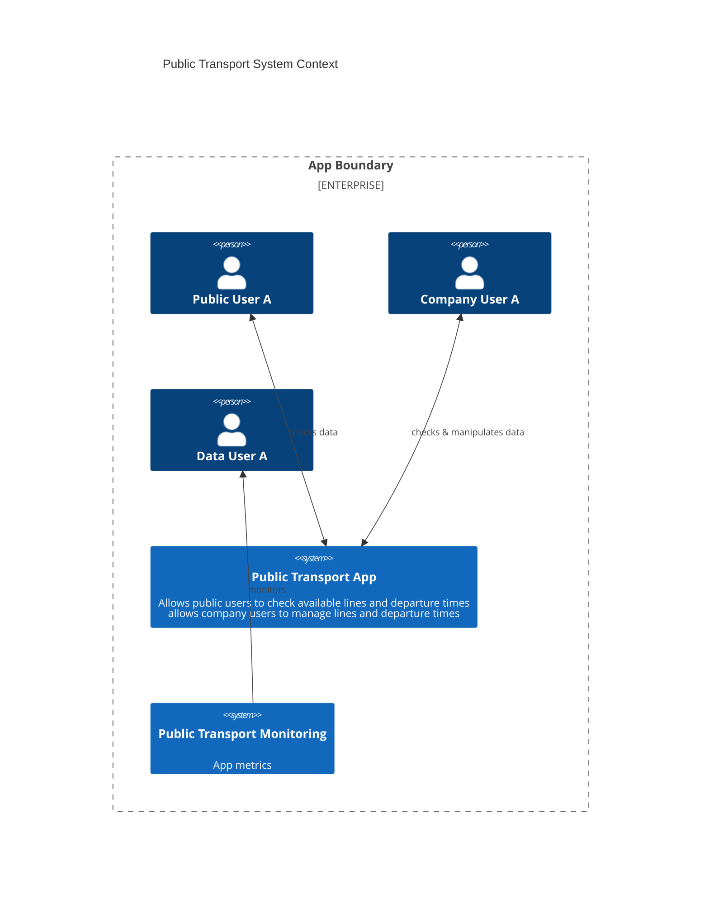
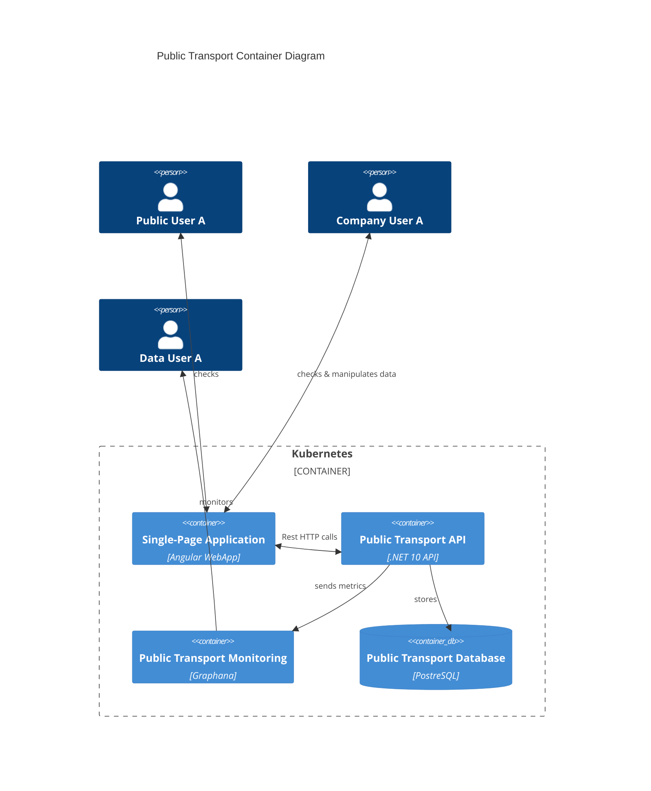

# System architecture of public transport app

## System Diagram

```mermaid
C4Context
    title Public Transport System Context
    
    Enterprise_Boundary(b0, "App Boundary") {
        Person(userA, "Public User A")
        Person(companyUserA, "Company User A")
        Person(dataUserA, "Data User A")
        
        System(frontend, "Public Transport App", "Allows public users to check available lines and departure times<br/>
        allows company users to manage lines and departure times")
        System(monitoring, "Public Transport Monitoring", "App metrics")
    }
 
    BiRel(userA, frontend, "checks data")
    BiRel(companyUserA, frontend, "checks & manipulates data")
    
    Rel(monitoring, dataUserA, "monitors")
    
    UpdateLayoutConfig($c4ShapeInRow="3")
```

## Container Diagram

```mermaid
C4Container
    title Public Transport Container Diagram

    Person(userA, "Public User A")
    Person(companyUserA, "Company User A")
    Person(dataUserA, "Data User A")
    
    Container_Boundary(b0, "Kubernetes") {
        Container(frontend, "Single-Page Application", "Angular WebApp")
        Container(backend, "Public Transport API", ".NET 10 API")
        Container(monitoring, "Public Transport Monitoring", "Graphana")
        ContainerDb(db, "Public Transport Database", "PostreSQL")
    }
    
    BiRel(userA, frontend, "checks")
    BiRel(companyUserA, frontend, "checks & manipulates data")
    BiRel(frontend, backend, "Rest HTTP calls")
    
    Rel(backend, db, "stores")
    Rel(backend, monitoring, "sends metrics")
    Rel(monitoring, dataUserA, "monitors")

    UpdateRelStyle(backend, monitoring, $offsetX="-40")
    UpdateRelStyle(backend, monitoring, $offsetY="-20")
    UpdateRelStyle(backend, db, $offsetX="-40")
    UpdateRelStyle(frontend, backend, $offsetX="-40")
    UpdateRelStyle(frontend, backend, $offsetY="-20")
    
    UpdateLayoutConfig($c4ShapeInRow="3")
```

## Component Diagram

...