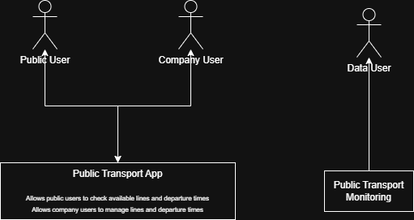
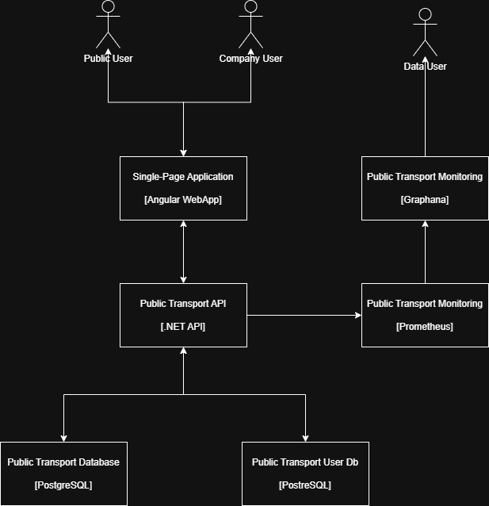
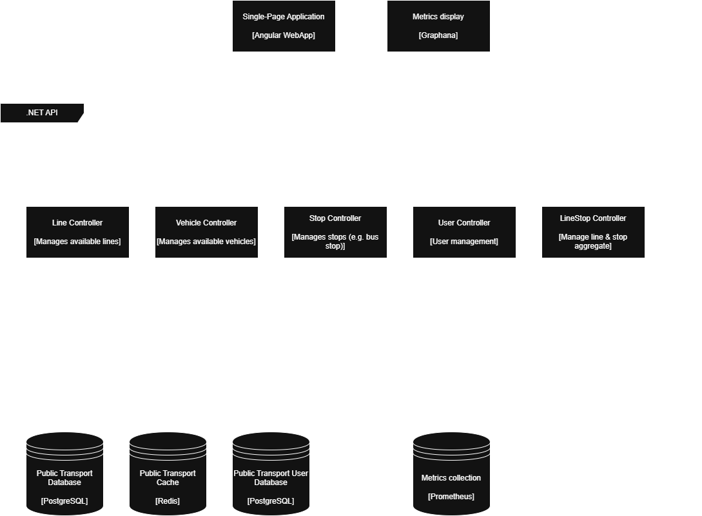
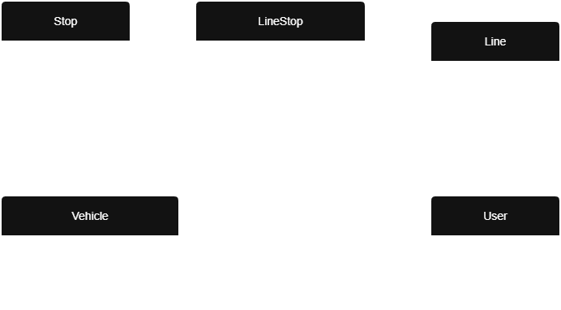
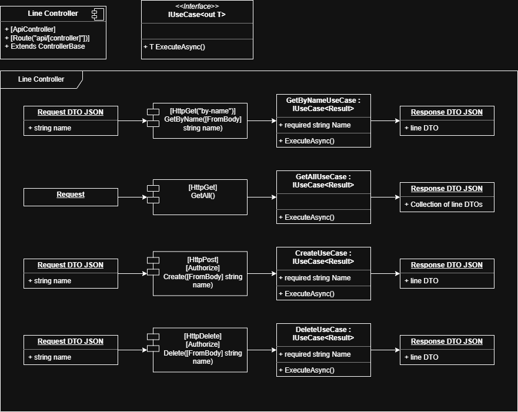
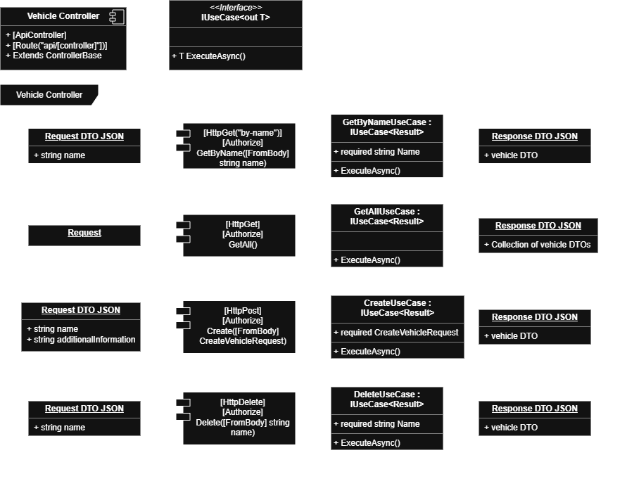
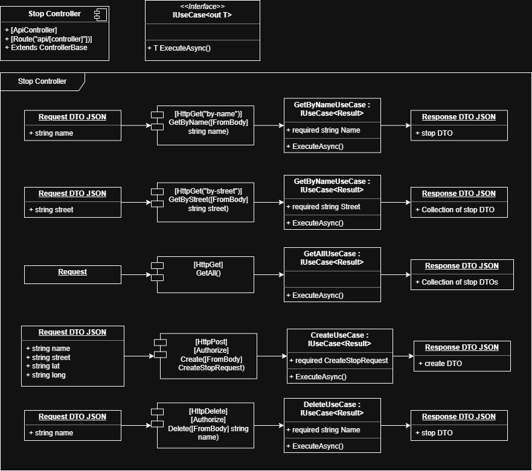
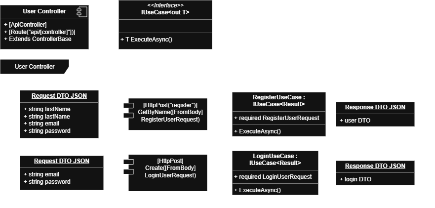

# System architecture of public transport app

## System, Container & Component Diagram

### System Context Diagram

   

### Container Diagram

   

### Component Diagram

   

## Code Level Diagrams

### Entities

   

### Line Controller

   

### Vehicle Controller

   

### Stop Controller

   

### LineStop Controller

   

### User Controller

   
